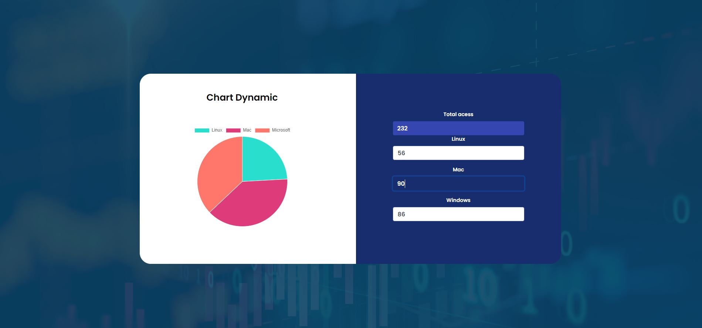

# chart-plot-intelie
Repository references the challenge the charts plot

The challenge proposed was the creation of a dynamic graphic following some requirements. Although it is not the ideal form proposed by the initial challenge, this is a chart that I assembled with little knowledge, this is my first chart.

Although it does not enter in the proposed requirements, the graphic was programmed with the aid of css, javascript and html. The graphic showing in the image, is dynamic and interacts with the user.

The idea of the graphic is that the user informs which of the operational systems have access for more time, being able to use if he has 1 year of access to that system or 2.5, as the user interacts with the graphic the total number of access of the 3 operational systems is being totaled.

Some important information: An id has been added to each input, with this we have the onblur method so that every time the user gives a TAB the method calls this function. 

